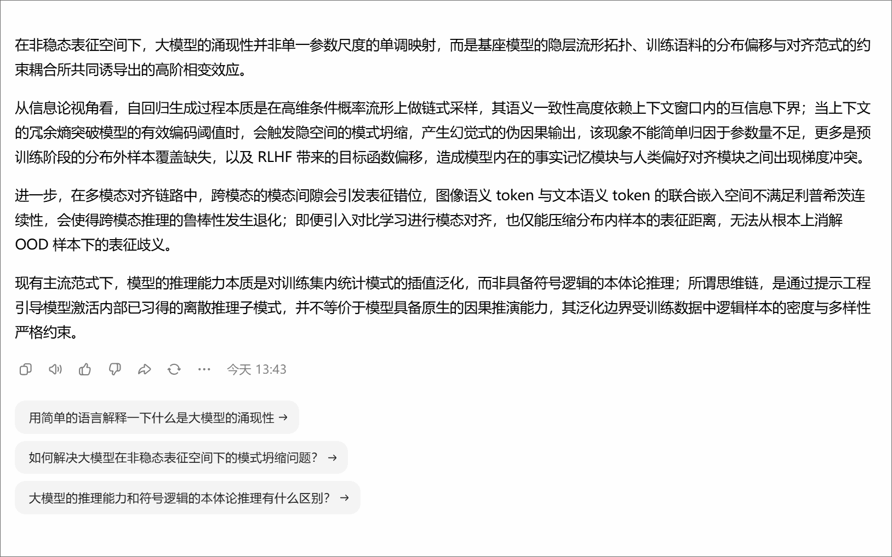

# ai-explain-extension-Chrome
ai文本解释助手Chrome插件

> Chrome Manifest V3 浏览器扩展｜Vibe‑Coding 实践项目

## 项目简介
浏览器 Chrome Manifest V3 插件。痛点：阅读豆包、DeepSeek 对话时，遇到不懂片段需要复制粘贴到输入框来回滚动，效率低；选中文本弹出悬浮按钮，弹窗直接调用 AI API 解释选中片段，流式输出回答。

项目采用 **Vibe‑Coding** 模式：以自然语言描述完整产品需求，借助 AI 完成整体编码，自己负责需求梳理、方案选型、Bug 调试（图标缺失报错、content‑script 跨域限制、SSE 流式解析）、功能迭代，最终产出可直接加载运行的扩展。

## 功能清单
- 鼠标选中文本，弹出悬浮「AI 解释」按钮
- 悬浮弹窗流式展示 AI 回答，不离开当前阅读位置
- 设置页配置 API‑Key，支持 DeepSeek / 火山方舟豆包双模型
- 使用 Background Service Worker 中转 API 请求，规避 content‑script 跨域限制
- Shadow DOM / 隔离样式，不污染原大模型网页

## 技术栈
Chrome Manifest V3、JavaScript、Content‑script、Service‑Worker、SSE 流式、Chrome Storage 存储配置

## 遇到的问题 & 解决（非常加分，体现调试能力，这是面试口述重点）
1. **加载扩展报错，缺少 icon 图标文件**
> 现象：导入插件直接报图标资源缺失无法加载；解决：删除 manifest 图标配置临时调试，后续补齐图标资源。

2. **content 脚本直接调用大模型 API 触发浏览器跨域拦截**
> 现象：页面脚本发起网络请求被浏览器安全策略拦截；解决：将网络请求迁移到 background service worker 做请求中转。

3. **SSE 流式返回解析异常**
> 现象：流式返回内容乱码、拼接异常；解决：处理 data 分片、过滤`[DONE]`结束标记，逐块推送到页面渲染。

4. **弹窗、悬浮按钮 DOM 泄露，点击外部没有关闭**
> 现象：悬浮元素残留、页面 DOM 越积越多；解决：增加完整 UI 销毁逻辑，实现点击页面外部关闭弹窗与悬浮按钮。

5. **悬浮图标不出现**
> 现象：选中文本无悬浮按钮；解决：调整 manifest 的`matches`匹配规则，放开站点注入范围，理解脚本注入与权限逻辑。

6. **点击悬浮图标无响应**
> 现象：按钮可见，但点击拿不到选中文本；解决：mouseup 阶段提前缓存选中的文本，click 事件读取缓存，不实时获取选区。

7. **点击图标后 UI 直接消失，弹窗无法展示**
> 现象：点击瞬间按钮销毁，弹窗来不及渲染；解决：处理事件冒泡，增加状态标记，通过`contains()`判断点击来源，避免误删UI。

8. **Extension context invalidated 上下文失效**
> 现象：插件重新加载后旧标签页消息通信报错；解决：修改代码后同步刷新网页，消息通信增加异常捕获。

9. **弹窗输出占位默认文本，得不到AI真实返回**
> 现象：配置正常却只显示兜底提示；解决：搭建全链路分层日志，定位是上下文失效触发错误分支，修复后刷新页面恢复正常。

## 使用演示
> ## 使用演示

> 操作流程：打开豆包网页 → 选中一段难懂文本 → 出现悬浮按钮 → 点击弹出浮窗，流式输出AI解释。

## 安装步骤：小白如何本地加载这个插件
1. 克隆/下载项目源码到本地文件夹
2. Chrome 扩展管理页面开启「开发者模式」
3. 点击「加载已解压的扩展程序」，选中项目文件夹
4. 在插件扩展选项页面填入自己的 API Key，选择对应模型服务商
5. 打开支持的网页，选中文本即可体验功能

## 局限说明（诚实，加分）
需要用户自己提供 API Key，无法复用网页端登录会话；部分复杂 Shadow‑DOM 网页存在选中文本兼容风险。

## 面试口述参考
> 我把模糊的业务痛点写成自然语言需求交给 AI 生成代码，过程中遇到扩展加载报错、跨域、流式解析、浏览器事件、插件上下文等各类 bug。我依靠控制台日志定位报错信息，调整架构、修改代码，经过多轮迭代打磨出可用产品。Vibe‑Coding 不是直接复制AI产出的代码，人负责需求定义、方案判断、排错调试、验证最终产品可用性。
